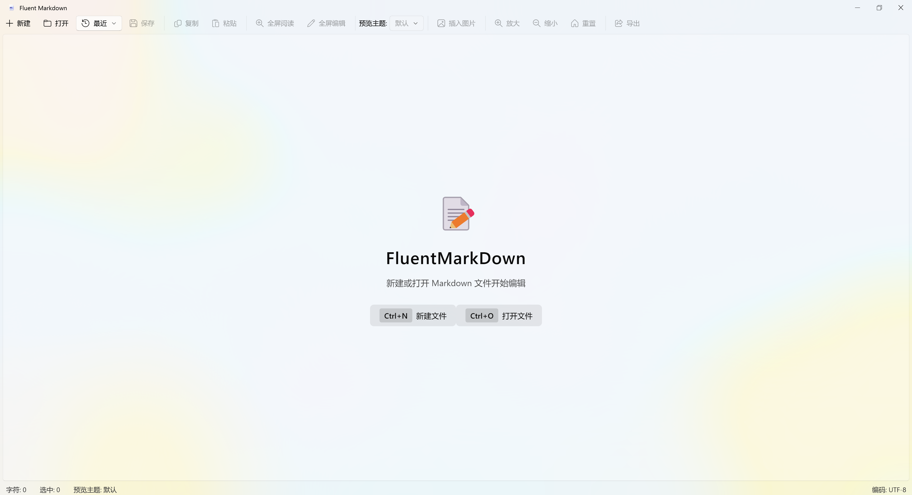
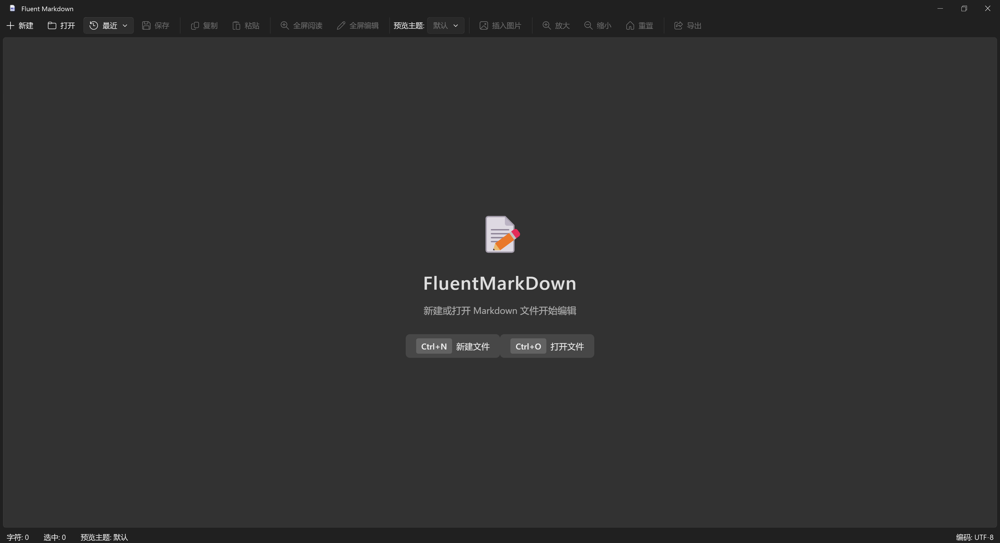

# Fluent Markdown Editor

一个支持 Mica 效果的现代化 Markdown 编辑器，使用 PyQt5 和 PyQt-Fluent-Widgets 构建。

## 界面展示

### 浅色主题



### 深色主题



## 功能特性

- ✨ **实时 Markdown 预览** - 支持实时渲染 Markdown 内容
- 🎨 **Mica 效果** - 支持 Windows 11 Mica 视觉效果
- 🎯 **Fluent Design 风格** - 现代化的微软 Fluent Design 界面
- 🖥️ **高分屏幕自适应** - 完美适配高分辨率显示器
- 📁 **文件管理** - 支持文件新建、打开、保存功能
- 🌓 **主题切换** - 支持浅色/深色主题切换
- 🎭 **多种预览主题** - 内置多种 Markdown 渲染主题
- 📊 **历史记录** - 记录最近打开的文件，快速访问
- 🖼️ **图片支持** - 支持插入本地图片和剪贴板图片
- 📱 **全屏模式** - 支持全屏阅读和全屏编辑模式
- 💾 **自动保存** - 自动定时保存文件内容
- 📤 **多格式导出** - 支持导出为 PDF、Word、HTML 格式

## 快捷键

| 快捷键 | 功能 |
|--------|------|
| Ctrl+N | 新建文件 |
| Ctrl+O | 打开文件 |
| Ctrl+S | 保存文件 |
| Ctrl++ | 放大字体 |
| Ctrl+- | 缩小字体 |

## 安装依赖

```bash
pip install -r requirements.txt
```

## 运行程序

```bash
python app.py
```

## 编译为可执行文件

```bash
# 安装 PyInstaller
pip install pyinstaller

# 运行编译脚本
python build.py
```

编译完成后，可执行文件将位于 `dist` 目录中。

## 项目结构

```
FluentMarkDown/
├── app.py                  # 应用主入口
├── build.py                # 编译脚本
├── generate_icons.py       # 图标生成工具
├── README.md               # 项目说明
├── requirements.txt        # 依赖项
├── models/                 # 模型层
│   ├── document.py         # 文档数据模型
│   └── themes.py           # 主题定义
├── views/                  # 视图层
│   └── markdown_editor.py  # Markdown 编辑界面
├── controllers/            # 控制器层
│   ├── editor_controller.py    # 编辑器控制器
│   └── export_controller.py    # 导出控制器
└── resources/              # 资源文件
    ├── icon.ico            # 应用图标
    ├── icoWin.svg          # Windows 图标源文件
    ├── icoMac.svg          # Mac 图标源文件
    └── img/
        └── readme/         # README 截图
```

## 技术栈

- **Python 3.8+** - 编程语言
- **PyQt5** - GUI 框架
- **PyQt-Fluent-Widgets** - Fluent Design 组件库
- **markdown** - Markdown 解析库
- **fpdf2** - PDF 导出库
- **python-docx** - Word 导出库

## 许可证

MIT License